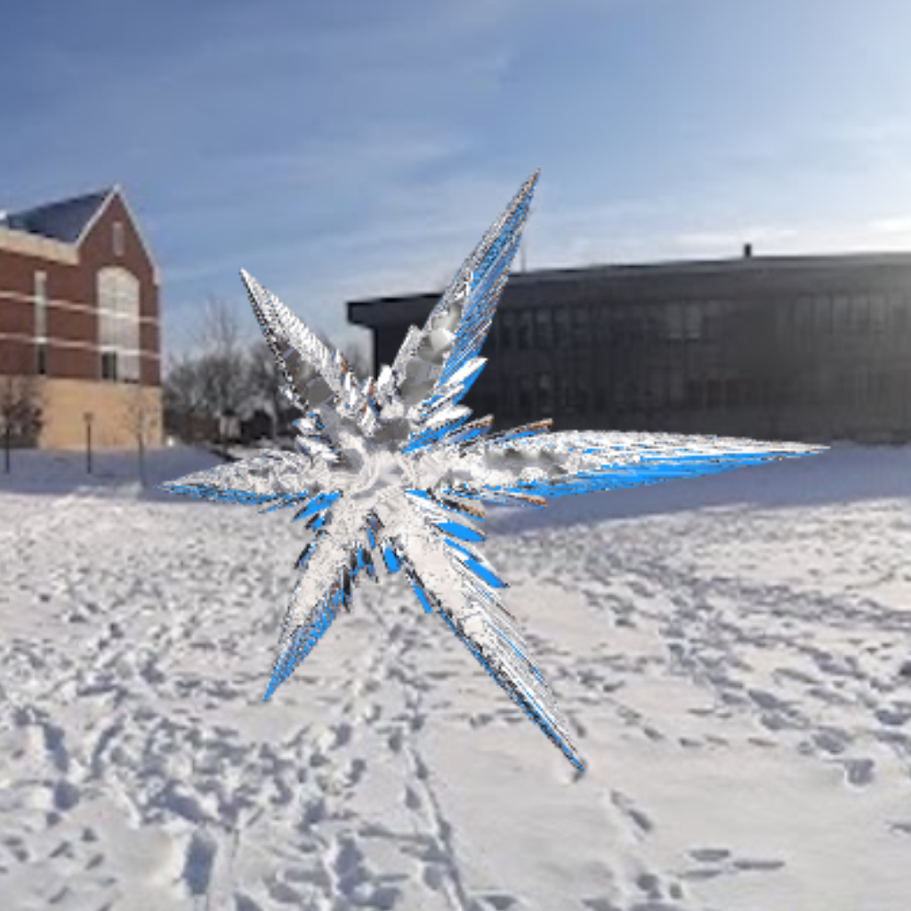
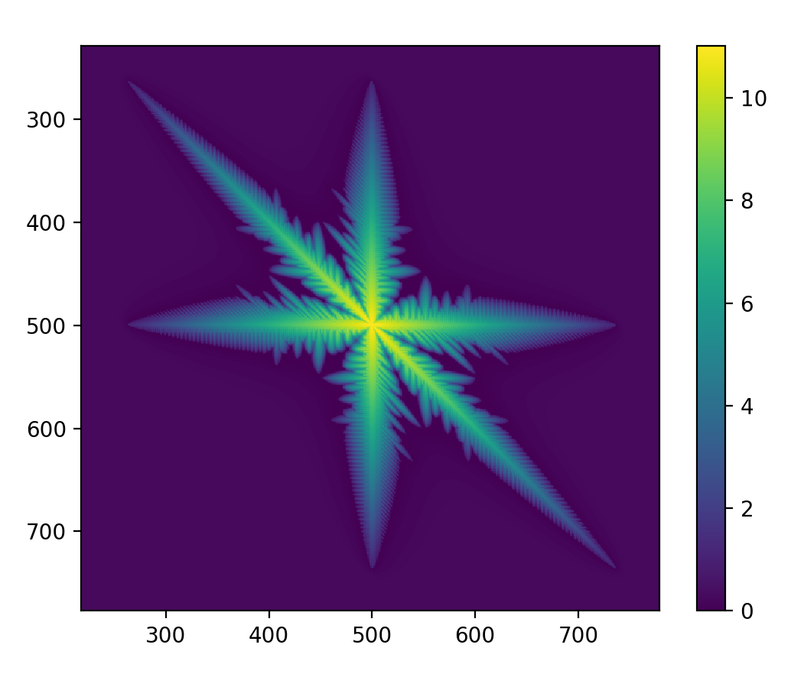
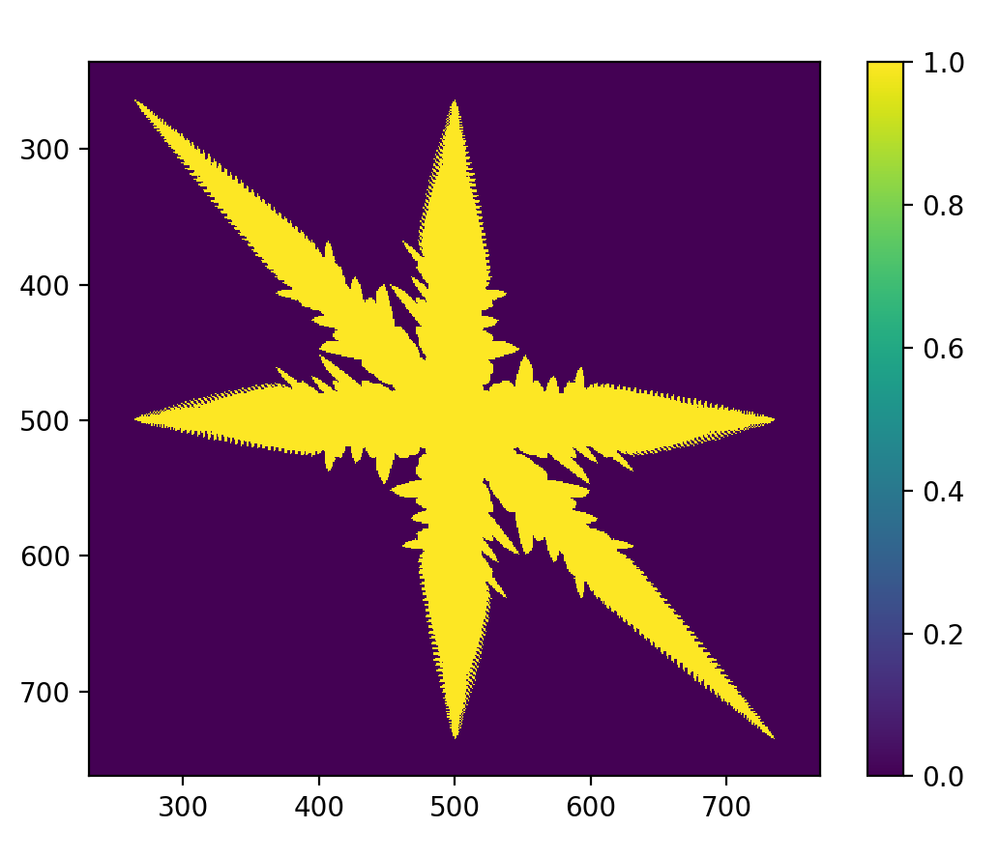
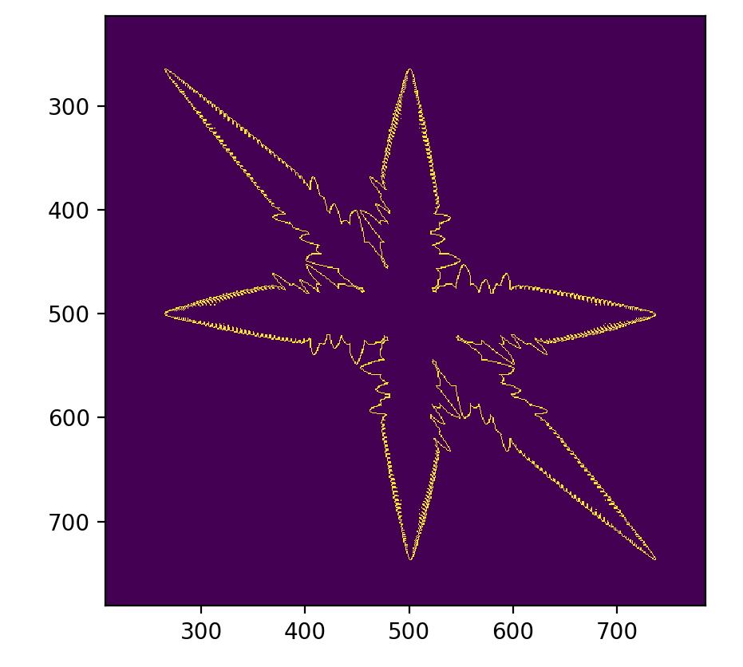
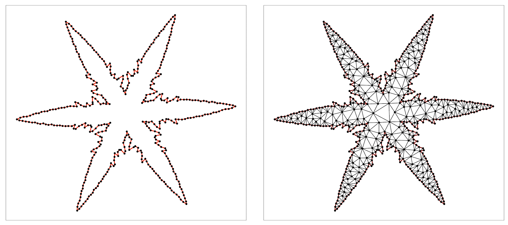
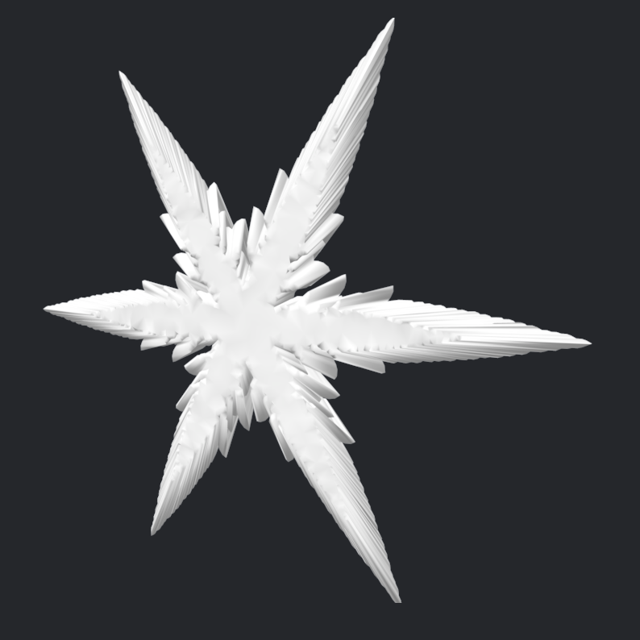

# Snowflakes in Shaw Field

This is our final project for COMP-465 Interactive Computer Graphics at Macalester College. We attempted to create a 3D mesh of a snowflake and render it with a physically based ice shader in a snowy environment.

## How to run it

To see our snowflake in Shaw field, simply run an HTTP server in the project directory and open `index.html` in any modern web browser. You can rotate the camera around the snowflake using the left and right arrow keys.

## Mesh generation

Generating the snowflake mesh was a major part of this project. Jacob had previously studied and implemented a model for snowflake growth called the Reiter model in a differential equations class. This is a cellular automaton model, which ultimately produces a matrix encoding the shape of the snowflake. The one that we will be working with here is this 1000x1000 matrix of floating point values:

Note that this image looks skewed—it's not a symmetrical 6-pointed snowflake yet. This is an artifact of the way that we implemented the Reiter model, but we can get rid of this later with a shear transform. From here, we need to pick out a sequence of points going around the boundary. We made up our own algorithm for this, which proceeds roughly as follows.

First, we pick out the boundary of the snowflake. In the Reiter model, a "cell" (entry in the matrix) with a value greater than 1 is "in the snowflake," so we produce a {0,1}-matrix of the cells in the snowflake:

And then we take a "discrete laplacian"—the laplacian is a second derivative operator from multivariable calculus, but the details aren't too important here. What is important is that this allows us to pick out where in the matrix values are different from their neighbors. This is useful because the cells outside the snowflake all contain 0 while the cells inside the snowflake contain 1, so the only place where we see 0's and 1's next to each other is on the boundary. This gives us a new matrix which looks like this:

Next, we'll actually start picking out the vertices. We're going to take advantage of the symmetry of the snowflake here. We'll pick out a sequence of points along one half of one _dendrite_ (1/6 of the snowflake), reflect it to get one full dendrite, and then rotate it 6 times to get the complete mesh. We will somewhat arbitrarily chose the top left one.

The algorithm proceeds as follows.

1. Initialize an empty list to store our vertices.
2. pick some point on the snowflake, and put it in the vertex list.
3. Look at all of the points lying on a circle of some small radius around the last vertex. These are candidate points.
4. Select a candidate according to some heuristic.
5. Goto (2) until you've gone far enough.

Because we decided to work with the top left dendrite, the heuristic that we chose was this: choose the lowest candidate, or, if there are multiple lowest candidates, choose the one farthest from the second to last vertex. Once this is done, we can construct the full outline of the snowflake. Next, we triangulate this outline using the `Triangle` package for Python:

Now we're ready to move into three dimensions. Our approach here was to stack our 2D snowflake on itself 3 times, and shrink the top and bottom face. "Stitching" together the sides produces the closed snowflake seen in the scene.

## Authors

 * Maddie AlQatami
 * Hannah Detlaff
 * Yuren Pang
 * Meghraj Singh
 * Jacob Weightman

 Special thanks to Prof. Lian Duan for her help and support on this project!